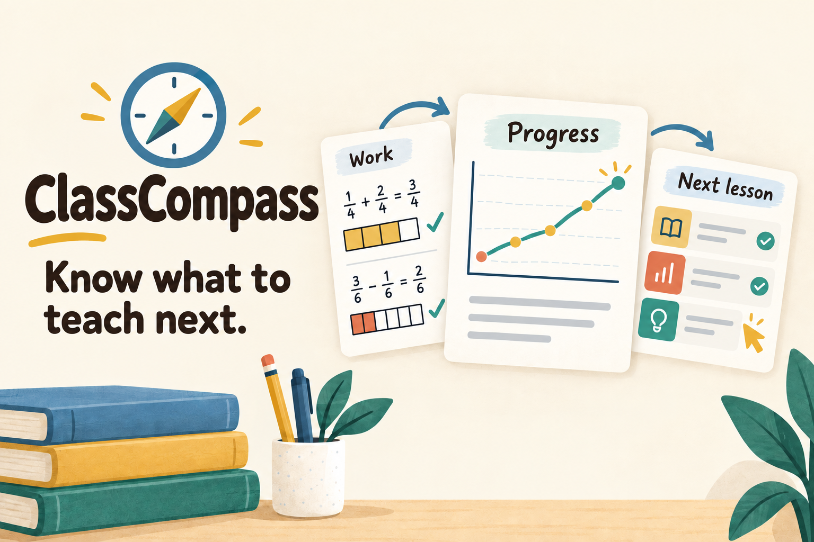
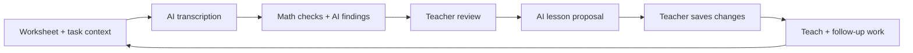

# ClassCompass

**Know what to teach next.**

ClassCompass helps teachers turn student work into a clear next step: who needs support, what to teach, and how to fit it into the lesson. AI connects patterns across assignments to suggested actions, with the original work one click away. The teacher reviews the evidence and chooses what changes.

Built for **SASEhack 2026** · Grade 5 math · Education

<p align="center">
  
</p>

[Try it locally](#try-it-locally) · [Judge walkthrough](#judge-walkthrough) · [How it works](#how-it-works) · [Verification](#verification)

[](https://github.com/RyanSXing/classcompass/actions/workflows/ci.yml)

## Why we built it

A worksheet score leaves a teacher with the hardest question: **what should I do tomorrow?**

Two students can get the same answer wrong for different reasons. One may add the denominators; another may understand equivalent fractions but make an arithmetic slip. A correct answer can also hide a need for help.

ClassCompass keeps the method, explanation, task and help provided beside each observation. It brings the most useful teaching actions forward, while keeping the detailed results available for inspection.

**Upload work → Review findings → Adjust the lesson → Teach → Check progress**

## What teachers can do

| Teacher question | ClassCompass |
| --- | --- |
| **What needs my attention?** | Two priority actions show who needs a check, why, what to do, how long it takes, and what to look for. |
| **How is understanding changing?** | Student stage bars, a skill radar and dated progress charts show independence and support needs. Open a student or date to inspect the work behind the picture. |
| **Can I trust this finding?** | Open the original worksheet and answer crop. Correct a reading or record help provided. Uncertain readings stay separate from incorrect answers. |
| **What should I teach?** | Review proposed changes beside their evidence. Save individual changes to a complete 45-minute lesson with materials, worked examples, and timed **Do / Ask / Check** steps. |
| **How does it fit the unit?** | Preview lesson and calendar effects while preserving teaching time and the fixed assessment date. Targeted groups can get help while classmates continue. |
| **Can I ask a follow-up?** | Ask the classroom assistant about students, assignments, goals, saved lessons or the calendar. Answers link back to sources. |

Understanding is shown as **Needs support**, **Getting there**, or **Works independently**. **Not enough evidence** stays separate. These stages describe the available work; they are not a permanent label or a validated mastery score.

### A concrete example

In the fictional first assignment, several students write `1/2 + 1/3 = 2/5`. The teacher can inspect their working, confirm the pattern, and review a lesson change that uses fraction strips to revisit equal-sized parts.

The class then works in parallel: targeted support, independent practice and extension fit inside the existing **12-minute practice block**. Follow-up work informs the next recommendation. Earlier work and saved lessons remain available, so the teacher can see what changed.

## Try it locally

Use **Node.js 24**; the pinned version is in [.nvmrc](.nvmrc). The sample workflow needs **no API key, Supabase project or sign-in**.

```sh
git clone https://github.com/RyanSXing/classcompass.git
cd classcompass
npm ci
cp .env.example .env.local
npm run dev
```

The copy command is for a fresh checkout. Keep an existing `.env.local` if you have already configured the app.

Open **[http://127.0.0.1:3000](http://127.0.0.1:3000)**, then choose **Assignments → Load sample class**.

This loads **8 fictional students, 5 dated assignments, 40 worksheets and 5 lesson plans**. Sample readings are prepared and labeled. Loading them preserves existing corrections and reviews; it does not approve findings for the teacher. Work persists in `.local/classcompass`.

Local mode runs only on your machine. Connected use has a teacher sign-in through Supabase; see [Supabase setup](docs/supabase-setup.md).

## Judge walkthrough

1. **See the next step.** Open the overview and inspect the two actions. Generate teaching insights in **Sample** mode to explore the prepared-data workflow without credentials.
2. **Follow the evidence.** Explore a skill, student and earlier date. Compare shown methods and recorded help, then open the original response.
3. **Correct an interpretation.** In **First check**, inspect Finley's uncertain reading. The source says `1/2`; the prepared reading deliberately says `1/5`. Correct it and review the updated evidence.
4. **Make a teaching decision.** Review and approve relevant teaching notes. Open the lesson for the latest reviewed assignment, compare proposed changes, and save only the changes you want.
5. **Use the result.** Inspect the lesson timeline, printable activities and calendar. Ask the assistant: “What should I check before the next lesson, and which work supports that?”

The handwriting mistake is an explicit sample case, not an error injected into live processing. To try the upload path, use **Upload work → First check → Load sample worksheets → Analyze this upload** in a fresh local workspace.

[Detailed walkthrough](docs/demo-guide.md) · [Blank worksheet](public/demo/baseline-template-v1.pdf) · [Original lesson](public/demo/lesson-2026-09-23-original.pdf) · [Teacher answer keys](public/demo/classcompass-teacher-answer-keys.pdf)

## How it works

Live processing follows this loop. Sample mode uses prepared readings and suggestions based on the saved work.



Three boundaries make the workflow inspectable:

- **AI reads and suggests.** It transcribes known worksheet layouts, proposes findings, drafts lesson changes and answers questions using classroom context.
- **Code checks the result.** Exact fraction arithmetic, response references, evidence revisions, lesson timing and student groups are validated before a proposal can be saved. This catches defined errors; it does not prove every AI interpretation correct.
- **The teacher decides.** Readings and help can be corrected. Teaching notes need review. Chat cannot approve findings or change a saved lesson. Accepted lesson versions preserve their history.

Corrections invalidate affected findings and drafts so old interpretations do not silently become new plans. Source links retain the student, task, date and response version.

### Built with

| Layer | Technology |
| --- | --- |
| App and backend | Next.js App Router, React, TypeScript |
| Interface | Tailwind CSS, Radix primitives, Lucide icons, custom charts |
| AI | Direct DeepSeek API or OpenRouter, called server-side |
| Validation | Zod schemas and deterministic domain checks |
| Connected data | Supabase Auth, PostgreSQL and private Storage |
| Document handling | PDF.js and Sharp |
| Testing | Vitest, Playwright and GitHub Actions |

### Sample and live AI

The default checkout uses **prepared worksheet readings** and labeled **Sample** assistance. Sample insights use the current saved evidence, including teacher corrections. A provider failure never silently switches live work to prepared results.

For live worksheet processing, edit `.env.local` and restart:

```dotenv
AI_MODE=live
AI_PROVIDER=deepseek
DEEPSEEK_API_KEY=your_private_key
```

Direct DeepSeek calls are billed to your account. OpenRouter is also supported with `AI_PROVIDER=openrouter` and `OPENROUTER_API_KEY`; that adapter permits configured free endpoints only. Model settings are in [.env.example](.env.example). Provider availability and output quality can vary.

The overview and assistant also have their own **Live AI** selection. Each reading and generated answer retains its source mode; live chat does not turn prepared worksheet readings into live OCR.

For authenticated storage, follow [Supabase setup](docs/supabase-setup.md). API keys and teacher credentials stay in local configuration, outside Git.

## Verification

The project includes tests for arithmetic, evidence links, corrections, teacher approval, lesson constraints, uploads, chat, history and browser workflows.

```sh
npm run verify               # Specifications, lint, types, unit tests and production build
npx playwright install chromium
npm run test:e2e              # Isolated browser workflows on port 3001
```

The specification check also needs **Python 3**. Browser tests use a separate workspace and preserve the normal local class.

[GitHub Actions](https://github.com/RyanSXing/classcompass/actions/workflows/ci.yml) runs the credential-free checks. [Verification results](docs/verification-results.md) records the scope of completed checks, including separate live-provider and Supabase tests. Prepared-data test results are not handwriting-accuracy or learning-outcome measurements.

## Scope and next steps

The working prototype covers one Grade 5 fraction-addition unit, five registered worksheet layouts and a wider-calendar preview. All students and worksheet images are fictional. It has not been validated in a real classroom or on real children's handwriting.

Next, we would work with teachers to check whether the suggested actions are useful, evaluate extraction on consented work, and add more units and worksheet layouts. The aim is to help teachers spend less time assembling evidence and more time responding to it; time savings and learning gains still need to be measured.

Development was assisted by **OpenAI Codex**. The project cover was made with image generation. Worksheet samples are reproducibly generated; [asset generation and font licenses](docs/asset-generation.md) explains their source.

[Implementation details](docs/implementation.md) · [Data and API contracts](docs/03-data-and-api-contracts.md) · [AI contracts](docs/05-ai-contracts-and-prompts.md) · [Original scope](docs/00-decisions-and-scope.md)
