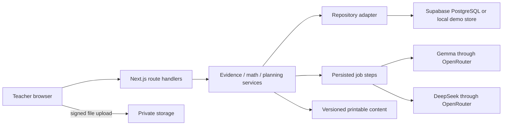

# Architecture and operations

## Application structure

Build one Next.js App Router application in TypeScript, using the Node.js runtime for API handlers. Use server-rendered page shells and client components for upload, review, editing, processing progress, and the calendar. Put domain logic in server-side services rather than JSX or route handlers. Next.js's backend-for-frontend facilities support this HTTP/API role; long-running execution and filesystem persistence depend on the host. See the [official guide](https://nextjs.org/docs/app/guides/backend-for-frontend).



The diagram's direct storage upload applies to Supabase mode. Local mode streams files through its local upload endpoint. Both feed identical asset metadata and domain services.

## Dependencies and version policy

| Purpose | Choice |
| --- | --- |
| Application | Next.js 16 stable line; compatible React, TypeScript, ESLint |
| Styling/components | Tailwind CSS 4 and shadcn/ui components; Lucide icons |
| Validation | Zod 4 for requests, persistence boundaries, and model output |
| Connected data | `@supabase/supabase-js` and `@supabase/ssr` |
| AI transport | Server-side native `fetch` to OpenRouter chat completions |
| PDF preview/normalization | `pdfjs-dist`, loaded on the client with its matching worker |
| Verification | Vitest for domain/service tests; Playwright for browser flows |
| Printing | Accessible HTML, SVG fraction models, print CSS, browser Print/Save as PDF |

Use npm and commit the generated lockfile. Resolve compatible stable patch versions at build time from current official documentation; record exact installed versions in the implementation README. Do not use canary releases or invent future package versions. Use an installed supported Node.js LTS satisfying Next.js requirements, and record it in `.nvmrc`/`engines`. Current installation requirements are in [Next.js documentation](https://nextjs.org/docs/app/getting-started/installation).

Suggested source tree:

```text
app/                         pages, route handlers, loading/error boundaries
components/                  application UI and copied shadcn components
lib/contracts/               Zod schemas and inferred TypeScript types
lib/domain/                  fractions, findings, review, plans, calendars, progress
lib/server/                  authorization, services, repository and AI adapters
lib/server/repositories/     local and supabase implementations
lib/server/ai/               OpenRouter transport, prompts, fixture provider
lib/server/jobs/             leases, scheduling, retries, step dispatcher
lib/fixtures/                allowed runtime fixture projections
supabase/migrations/         schema, constraints, RLS, atomic database functions
scripts/                     fixture generation, seed, reset, diagnostics
tests/                       domain, integration, browser tests
public/demo/                 generated synthetic demo files, clearly labeled
.local/classcompass/         ignored local state and uploaded files
```

The full ground-truth JSON in `docs/fixtures` belongs to test/asset-generation code. Do not import it wholesale into live model adapters. See document 05 for permitted model payloads.

## Configuration and execution modes

Two independent server-side switches:

| Data backend | AI mode | Required behavior |
| --- | --- | --- |
| `local` | `fixture` | Default, fully usable local demo, no credentials or network inference |
| `local` | `live` | Same local workflow, real OpenRouter calls with a server key |
| `supabase` | `fixture` | Persistent authenticated connected demo, prepared AI outputs visibly labeled |
| `supabase` | `live` | Full connected application with authenticated storage and real inference |

Never silently change either mode. Live provider failure displays a retryable or actionable error. A teacher can explicitly choose fixture mode only through documented developer configuration/restart, with a visible mode label. Persist provider mode, exact model ID, prompt version, and generation time on results.

Create a root `.env.example` during implementation from `docs/examples/env.example`. Real secrets stay in ignored local environment files or the host's secret settings. Expose only Supabase URL/publishable key to the client; OpenRouter and Supabase administrative keys remain server-only.

`local` uses a fixed fictional teacher identity and binds development/start scripts to `127.0.0.1`. Refuse local mode on Vercel or when `APP_DEPLOYMENT=hosted`. Local storage is not a public deployment option. Store a versioned JSON document plus assets in `.local/classcompass`; protect mutations with an exclusive lock and write-to-temp/rename commits. Commit all related entity changes in one store write. Recovery from an abandoned lock requires checking expiry and owner; never allow simultaneous writers. Document this single-instance limitation.

## Authentication and authorization

Connected mode uses Supabase Auth with a pre-provisioned demo teacher and email/password login. Include logout and session-expired handling. Account signup, invitations, and password-reset flows are outside this demo. Follow the current [Supabase server-side client guidance](https://supabase.com/docs/guides/auth/server-side/nextjs); authenticate server requests using verified claims/user identity, not a trusted client-supplied teacher ID.

All classroom records and assets carry an owner ID. Enforce ownership both in route services and with RLS. Browser calls use the public key plus the user's session. Ordinary server calls also use user-scoped clients; administrative keys are reserved for explicit provisioning/seed operations. Teacher A must not see teacher B's records even by guessing a URL.

Use same-origin route handlers, HTTP-only session cookies per Supabase guidance, origin checks on cookie-authenticated mutations, and server-side validation. Model keys are never sent to the browser. Escape all model and worksheet text; do not render arbitrary HTML. Log job IDs and error codes rather than complete student submissions or secrets.

## Upload and import design

Limits are deliberate prototype defaults: 8 files per batch, one worksheet page per student, 5 MiB per source file, 40 MiB total; lesson PDF at most 3 pages/5 MiB. Accept PNG, JPEG, or PDF with actual matching signatures. Reject encrypted PDFs, unsupported layouts, unreasonably large decoded images (over 20 megapixels), and invalid files with an actionable message before inference. Baseline and follow-up use different selected templates.

1. Teacher selects the activity/template and maps each file to a roster student. Demo filenames can prefill a mapping, but require visible confirmation. Never infer identity from model output.
2. Preview the original and normalized page. Use PDF.js locally for PDF rendering; browser canvas handles image rotation/normalization. Require a clear upright page matching the known template. Do not claim arbitrary photo dewarping.
3. Preserve original bytes. Generate a normalized page image, hash it, and link it to the source asset. Fixed normalized question rectangles come from the selected template; the model does not invent highlight coordinates.
4. In Supabase mode, request authorized object paths and upload through signed URLs to a private bucket. This avoids routing multi-megabyte file bodies through a hosted function. Finalization verifies ownership, actual object size/type, hashes, and metadata before a batch can run. Local mode supplies an equivalent upload service.
5. Keep object names generated by the server: `owner/classroom/batch/asset-id/original.ext` and normalized derivatives. Do not accept arbitrary filesystem paths or external fetch URLs from users.

Serve source previews through short-lived signed URLs or an authorized local file route. Refresh expired previews without losing review edits. Supabase [private buckets](https://supabase.com/docs/guides/storage/buckets/fundamentals) require controlled access; a public URL is not the default.

Lesson import is a separate preview-and-confirm step. The authored demo lesson PDF contains selectable text and ordinary headings: lesson title, date, objective, and block titles with minutes. Extract its text with PDF.js, parse the supplied known layout, then show editable block fields and the original PDF. A documented JSON import of the same `LessonSnapshot` is also supported. Unsupported or unreadable PDFs retain the original preview and present manual entry; never substitute the seed lesson for an arbitrary uploaded file. Confirming import creates the initial immutable lesson version only after totals and fields validate.

## Resumable processing without a separate worker

Use persisted jobs and steps. A job is not a fire-and-forget promise started after returning HTTP 202.

- Creation stores a queued job. The review page calls `POST /api/jobs/:id/run-next`, waits for that one step, displays progress, and then advances the next eligible step. `GET /api/jobs/:id` is read-only.
- Every `run-next` call atomically claims a step with a 180-second lease and random lease token. A second tab cannot claim the same step. Writes at completion require the still-current token and input fingerprint.
- One step performs at most one external model call. A baseline job normally has eight extraction steps plus one text-analysis step. A plan job is one separate step. Follow-up follows the same pattern. Non-network validation can run in the same step.
- Use a 75-second provider timeout and a handler hosting budget of at least 120 seconds, validated against the chosen host. Expired leases can be reclaimed. A crash after inference may cause an additional provider call on retry, but must not duplicate database results.
- Persist `attemptCount`, `nextAttemptAt`, error code, and completed step output. Retry a transient timeout/429/5xx at most twice after the initial attempt. Honor `Retry-After`; otherwise use 5/15-second backoff with small jitter. Wait in the browser/scheduler rather than sleeping inside a hosted handler.
- Persistently gate dispatch across the teacher's jobs to one in-flight call and at least four seconds between starts. This leaves headroom below the published free-model per-minute limit. Daily quota exhaustion blocks further dispatch and reports when retry may be possible.
- Closing the browser pauses further dispatch; completed outputs survive. Reopening presents Resume. Document that ongoing requests may either complete or expire. This design does not promise processing continues unattended.
- Cancellation prevents new steps and causes late results to be ignored by lease/status checks. User edits during analysis invalidate the affected fingerprint; late output is archived as stale and cannot overwrite teacher edits.

Extraction cache identity includes normalized file hash, template version, model ID, and prompt version. Reusing an extraction never discards teacher corrections. Analysis/proposal identity additionally includes effective response revisions, support metadata, confirmations, lesson version, and constraints. See document 03 for atomic apply.

## Printing and calendar

Material content is a structured snapshot attached to an accepted lesson version. Render a clean print-only document with title, objective, instructions, working space, and optional separate teacher key. Fraction bars are generated SVG geometry. Keep names off group sheets by default. Check both US Letter and A4; prevent a question from splitting across pages. Browser Print/Save as PDF fulfills the export requirement.

Build the unit calendar and wider year preview as application components using authored schedule data. Store dates as local `YYYY-MM-DD` values, not UTC timestamps masquerading as school days. Store audit times in UTC. The demo teaching timezone is America/Chicago. Fixed dates, prerequisites, and available teaching days are validated in ordinary code. A targeted checkpoint can fit inside an existing block; it does not add teaching time to a full day.

## Deployment and observable failures

Local development is the required first run. Hosted deployment, when requested, uses Vercel plus Supabase. It requires auth, persistent storage, environment variables, a sufficient function duration, and successful migration/seed checks. If the host cannot support the bounded step duration, adjust the step/job host explicitly; do not silently drop analysis or pretend polling is a worker.

Provide an authenticated diagnostics view or command showing configured modes, model IDs, prompt versions, schema version, storage availability, and redacted provider errors. It must never display secret values. No paid inference, new paid infrastructure, automatic model substitution, or external publication occurs merely to make a test pass.
